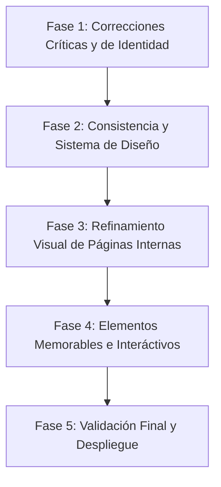

# Informe de Auditoría Integral UI/UX — Hidromont Chile

**Sitio Web Corporativo e Infraestructura CMS**  
**Fecha de evaluación:** 24 de Julio de 2026  
**Auditor:** Especialista Senior UI/UX & Frontend Architecture  
**Repositorio:** `Hidromont Chile / pagina-web`  

---

## 1. Resumen ejecutivo

El sitio web corporativo de **Hidromont Chile** (`hidromont.cl`) presenta una sólida base estética e identitaria, construida sobre una dirección de arte industrial coherente ("*industrial aesthetic*"), caracterizada por bordes rectos (`rounded-none`), tipografía técnica (*Roboto Condensed* e *Inter*), sombras sutiles y una paleta de color profesional dominada por azul corporativo (`#0065A9`), azul oscuro marino (`#004B7D`) y acento cian (`#00A6D6`).

### Principales fortalezas
- **Dirección artística alineada al rubro:** La estética minimalista industrial transmite solidez técnica, capacidad de fabricación pesada y seriedad corporativa, ideal para una empresa de ingeniería hidromecánica.
- **Rendimiento percibido y microinteracciones de entrada:** Implementación eficiente de animaciones con `IntersectionObserver` (`motion.ts`), Ken Burns suave en el Hero principal, y soporte completo para `prefers-reduced-motion`.
- **Formularios con validación accesible y anti-spam:** El formulario de contacto (`ContactForm.astro`) implementa validación inline con ARIA live regions, honeypot anti-bot (`_honey`) y rate limiting en `sessionStorage`.
- **Galería con control segmentado y Lightbox accesible:** Filtros por categoría estilo "segmented control" con navegación por teclado ARIA radio group y modal Lightbox progresivo.

### Principales debilidades
- **Desconexión visual entre el CMS Overlay y la Web Pública:** El cliente CMS (`cms-overlay.js`) utiliza bordes redondeados (`border-radius: 6px/8px`), tonos de azul dispares (`#2d9cdb`) y tipografías por defecto del sistema que rompen la estética industrial de 0px del sitio público.
- **Valores hardcodeados y dispersión de tokens:** Presencia de estilos inline (`style="..."`), colores hexadecimales repetidos fuera de variables CSS (`tokens.css` vs `tailwind.config.mjs`) y gradientes aplicados manualmente.
- **Inconsistencia de logos e inversiones de contraste:** El encabezado (`Header.astro`) aplica `brightness(0) invert(1)` al logo en el estado transparente del Hero, convirtiéndolo en un dibujo plano monocromático blanco y saltando abruptamente al hacer scroll.
- **Desigualdad de jerarquía entre la Home/Empresa y Páginas Internas:** Las páginas de servicios y proyectos en formato catálogo/tabla lucen significativamente más sobrias y planas que el inicio o la página corporativa.
- **Blancos táctiles ajustados en dispositivos móviles:** En pantallas menores a 640px, ciertos elementos interactivos de tablas y filtros se encuentran al límite de la superficie táctil recomendada (44×44px).

---

## 2. Evaluación general

A continuación se presenta la matriz de calificación cuantitativa (escala 1 a 10) por cada dimensión evaluada:

| Dimensión | Calificación | Estado / Comentario principal |
| :--- | :---: | :--- |
| **Estética general** | **8.5 / 10** | Excelente personalidad industrial, muy alineada al sector de ingeniería pesada. |
| **Armonía visual** | **8.0 / 10** | Buen balance entre bloques oscuros y claros; ritmo de espaciado limpio. |
| **Consistencia** | **7.5 / 10** | Inconsistencias puntuales en radios de borde CMS y valores de color hardcodeados. |
| **Identidad corporativa** | **8.5 / 10** | Transmite confiabilidad, trayectoria de más de 40 años e infraestructura real. |
| **Jerarquía visual** | **8.0 / 10** | Titulares claros, leyendas legibles y contrastes bien marcados. |
| **Tipografía** | **8.0 / 10** | Excelente combinación de Inter + Roboto Condensed + Roboto Mono. |
| **Uso del color** | **8.2 / 10** | Paleta sobria y corporativa; contraste suficiente en el 95% de las secciones. |
| **Calidad de imágenes** | **8.5 / 10** | Fotografía real de taller y proyectos (no stock genérico). |
| **Galería** | **8.2 / 10** | Grilla uniforme, LQIP blur-up, filtros por categoría y lightbox fluido. |
| **Navegación** | **8.0 / 10** | Menú responsive funcional, indicador activo y breadcrumbs estructurados. |
| **Responsive** | **7.8 / 10** | Adaptación fluida; requiere ligera optimización de objetivos táctiles en tablas. |
| **Accesibilidad** | **8.2 / 10** | Skip link, roles ARIA, focus rings visibles y soporte para movimiento reducido. |
| **Formularios** | **8.5 / 10** | Validación inline, mensajes claros, anti-spam client-side y feedback visual. |
| **CMS** | **7.2 / 10** | Altamente funcional y seguro, pero visualmente desalineado del sistema de diseño. |
| **Microinteracciones** | **8.0 / 10** | Animaciones sobrias con scroll reveal y marquee sin sobrecargar. |
| **Rendimiento percibido** | **8.8 / 10** | Carga ultra rápida (Astro SSG + WebP responsivo + font preloading). |
| **Sensación de calidad** | **8.2 / 10** | Se percibe como una empresa seria, consolidada e industrial. |
| **Factor memorable** | **7.5 / 10** | Muy profesional; podría enriquecerse con esquemas o diagramas técnicos interactivos. |
| **Preparación para producción** | **8.5 / 10** | Apto para publicar tras resolver ajustes menores de pulido visual. |

### **Nota Global Final: 8.2 / 10**

---

## 3. Veredicto

### **Listo para producción con ajustes menores**

**Justificación:**  
El sitio se encuentra en un estado sumamente avanzado, estable y profesional. Funcionalmente cumple con creces todos los requisitos técnicos, SEO, semánticos y de accesibilidad. No posee fallas bloqueantes ni errores estructurales. Las recomendaciones presentadas en este informe apuntan a pulir pequeñas inconsistencias visuales, homogeneizar la interfaz del CMS con la identidad del sitio público, y elevar la percepción de calidad técnica de la marca a un nivel extraordinario.

---

## 4. Fortalezas

1. **Identidad Industrial Definida:** El concepto visual de bordes rectos (`rounded-none`), tipografía *Roboto Condensed* para encabezados y detalles *Roboto Mono* para métricas técnicas transmite un carácter de manufactura pesada y precisión técnica de alto nivel.
2. **Fotografía Auténtica:** El uso de imágenes reales del taller en Los Ángeles, tuberías forzadas de gran diámetro, puentes grúa y maniobras de montaje en terreno dota al sitio de una enorme credibilidad institutional.
3. **Formulario de Contacto Robusto:** Validación accesible con `aria-describedby` y `aria-invalid`, prevención de spam mediante honeypot `_honey`, limitación de intentos en `sessionStorage` y feedback claro al enviar.
4. **Respeto Estricto por Accesibilidad y Movimiento Reducido:** Implementación rigurosa de `prefers-reduced-motion` en CSS y en JavaScript (`motion.ts`), pausando marquees y Ken Burns para usuarios con sensibilidad vestibular.
5. **Arquitectura SSG + CMS Ligero:** Astro genera HTML estático hiperrápido, mientras que el CMS en Node/Fastify + SQLite brinda edición in-situ mediante overlay script sin penalizar el rendimiento del visitante público.

---

## 5. Hallazgos críticos y altos

### [ALT-001] Inconsistencia visual del CMS Overlay respecto al sistema de diseño industrial

- **Severidad:** Alto
- **Área afectada:** CMS propio / Panel de edición
- **Ruta o pantalla:** Cualquier página con el parámetro `?cms=1` o sesión activa de administración
- **Archivo o componente relacionado:** [cms-overlay.js](file:///Users/allopze/dev/Hidromont%20Chile/pagina-web/src/scripts/cms-overlay.js#L17-L210)
- **Descripción del problema:** La barra flotante y el panel lateral del CMS utilizan estilos CSS inline inyectados con bordes redondeados (`border-radius: 6px/8px/999px`), sombras blandas y colores azules arbitrarios (`#2d9cdb`), rompiendo la regla de oro de la marca que exige bordes de 0px (`rounded-none`) y paleta primaria corporativa (`#0065A9`).
- **Por qué afecta la experiencia:** Aunque es un panel administrativo, al superponerse sobre la página pública genera una sensación de parche informal o plugin de terceros desintegrado de la línea gráfica corporativa.
- **Evidencia encontrada en el código:**
  ```css
  /* cms-overlay.js L45, L50, L158 */
  .hm-cms-bar { border-radius: 8px; background: #0f2433; }
  .hm-cms-bar button { border-radius: 6px; background: #2d9cdb; }
  .hm-cms-badge { border-radius: 999px; }
  ```
- **Recomendación concreta:** Ajustar los estilos inyectados en `cms-overlay.js` para emplear los tokens oficiales del sitio: `border-radius: 0px`, color primario `#0065A9` y tipografía `Inter`.
- **Ejemplo de solución:**
  ```diff
  - .hm-cms-bar { border-radius: 8px; background: #0f2433; }
  - .hm-cms-bar button { border-radius: 6px; background: #2d9cdb; }
  + .hm-cms-bar { border-radius: 0px; background: var(--color-background-strong, #0F2433); border: 1px solid var(--color-border, #D9E2EC); }
  + .hm-cms-bar button { border-radius: 0px; background: var(--color-primary, #0065A9); font-family: var(--font-body, sans-serif); }
  ```
- **Esfuerzo estimado:** Bajo
- **Impacto esperado:** Alto
- **Prioridad recomendada:** Fase 2

---

### [ALT-002] Inversión agresiva del logo en la cabecera del Hero transparente

- **Severidad:** Alto
- **Área afectada:** Encabezado / Identidad visual
- **Ruta o pantalla:** Página de Inicio (`/`)
- **Archivo o componente relacionado:** [Header.astro](file:///Users/allopze/dev/Hidromont%20Chile/pagina-web/src/components/layout/Header.astro#L276-L285)
- **Descripción del problema:** Al cargar la página principal en estado transparente sobre la foto del Hero, el script del header aplica `filter: brightness(0) invert(1)` sobre el archivo `logo_hidromont.png`. Esto convierte el logotipo en una silueta blanca plana, eliminando los colores originales de la marca. Al hacer scroll (>80px), la imagen pasa bruscamente a `filter: ''`, causando un parpadeo visual.
- **Por qué afecta la experiencia:** Debilita el reconocimiento inmediato del logotipo oficial y genera un salto cromático artificial al navegar verticalmente.
- **Evidencia encontrada en el código:**
  ```javascript
  /* Header.astro:285 */
  if (logoImg) logoImg.style.filter = 'brightness(0) invert(1)';
  ```
- **Recomendación concreta:** Servir la variante oficial del logo sobre fondo oscuro (SVG/PNG con texto y símbolo en blanco/azul claro nativo) o emplear un degradado suave de fondo (*scrim shadow*) en la cabecera fija que permita mantener el logo corporativo en sus colores originales sin perder legibilidad.
- **Ejemplo de solución:**
  ```astro
  <!-- Usar logo variante light nativa sin filtros CSS destructivos -->
  
  ```
- **Esfuerzo estimado:** Medio
- **Impacto esperado:** Alto
- **Prioridad recomendada:** Fase 1

---

## 6. Hallazgos medios y bajos

### [MED-001] Estilos e incrementos de espaciado hardcodeados en HTML

- **Severidad:** Medio
- **Área afectada:** Maquetación / Layout
- **Ruta o pantalla:** Inicio (`/`), Empresa (`/empresa`), Proyectos (`/proyectos`)
- **Archivo o componente relacionado:** [index.astro](file:///Users/allopze/dev/Hidromont%20Chile/pagina-web/src/pages/index.astro#L111-L128)
- **Descripción del problema:** Se utilizan propiedades `style="..."` directamente en componentes para controlar bordes, sombras internas y alturas máximas, en lugar de utilizar clases de Tailwind o variables del sistema de tokens.
- **Por qué afecta la experiencia:** Dificulta el mantenimiento y crea ligeras desviaciones de ritmo visual si se modifican los tokens globales en el futuro.
- **Evidencia encontrada en el código:**
  ```html
  <div class="relative overflow-hidden rounded-none" style="border: 1px solid rgba(255,255,255,0.08);">
    <div style="box-shadow: inset 0 1px 0 rgba(255,255,255,0.12), inset 0 -1px 0 rgba(0,0,0,0.2);"></div>
  ```
- **Recomendación concreta:** Crear clases utilitarias en `base.css` (ej. `.card-industrial-border`, `.shadow-inner-subtle`) y sustituir los atributos `style` directos.
- **Esfuerzo estimado:** Bajo
- **Impacto esperado:** Medio
- **Prioridad recomendada:** Fase 2

---

### [MED-002] Disparidad de densidad visual entre la Home y catálogos secundarios

- **Severidad:** Medio
- **Área afectada:** Experiencia de Navegación / Dirección de arte
- **Ruta o pantalla:** `/servicios` y `/proyectos`
- **Archivo o componente relacionado:** [servicios/index.astro](file:///Users/allopze/dev/Hidromont%20Chile/pagina-web/src/pages/servicios/index.astro), [proyectos/index.astro](file:///Users/allopze/dev/Hidromont%20Chile/pagina-web/src/pages/proyectos/index.astro)
- **Descripción del problema:** La página de inicio y la sección `/empresa` cuentan con ricas composiciones (imágenes destacadas, tarjetas de capacidades, bloques contrastados en azul oscuro). Sin embargo, los listados principales de `/servicios` y `/proyectos` pasan rápidamente a grillas uniformes o tablas de datos sin elementos visuales intermedios que rompan la monotonía.
- **Por qué afecta la experiencia:** Reduce el impacto emocional al profundizar en el sitio web, haciendo que las páginas internas se perciban más como un catálogo estático que como una presentación corporativa de alto nivel.
- **Recomendación concreta:** Incorporar banners intermedios con fotografías de proyectos reales o diagramas técnicos entre las grillas de servicios y las tablas de proyectos.
- **Esfuerzo estimado:** Medio
- **Impacto esperado:** Alto
- **Prioridad recomendada:** Fase 3

---

### [BAJ-001] Renderizado de texto provisional de edición en modo desarrollo

- **Severidad:** Bajo
- **Área afectada:** CMS / Componentes UI
- **Ruta o pantalla:** `/proyectos`
- **Archivo o componente relacionado:** [proyectos/index.astro](file:///Users/allopze/dev/Hidromont%20Chile/pagina-web/src/pages/proyectos/index.astro#L77-L83)
- **Descripción del problema:** Cuando una eyebrow no posee texto en la configuración del CMS, se renderiza la cadena `(Eyebrow vacía)` con opacidad reducida para permitir la selección in-situ en el CMS.
- **Por qué afecta la experiencia:** Si se compila el sitio o se edita en un entorno staging con la flag CMS activa, los visitantes podrían divisar el texto `(Eyebrow vacía)`.
- **Recomendación concreta:** Ocultar el elemento mediante CSS o renderizar un placeholder transparente únicamente cuando el usuario mantenga una sesión de edición iniciada.
- **Esfuerzo estimado:** Bajo
- **Impacto esperado:** Bajo
- **Prioridad recomendada:** Fase 2

---

## 7. Auditoría de la página pública

### Inicio (`/`)
- **Hero Principal:** Excelente impacto inicial. La tipografía fluida `clamp()` asegura un titular imponente en cualquier resolución. El efecto Ken Burns aporta dinamismo sin distraer.
- **Sección Servicios:** Las tarjetas con viñetas cortas brindan rápida escaneabilidad.
- **Capacidades e Instalaciones:** El bloque oscuro (`Section variant="strong"`) genera un excelente quiebre visual que resalta los 11.000 m² de superficie y los 5 puentes grúa.

### Empresa (`/empresa`)
- **Narrativa e Historia:** Muy bien estructurada. La cuadrícula de hitos (1983, EPC, ISO 9001) entrega prueba social e institucional inmediata.
- **Listado de Maquinaria:** Claro y técnico. Los bullets con formato `w-1.5 h-1.5 rounded-full bg-primary` ordenan perfectamente el equipamiento pesado.

### Contacto (`/contacto`)
- **Layout en 2 Columnas:** Formulario e información corporativa a la izquierda, iframe de Google Maps a la derecha. Excelente aprovechamiento de pantalla en escritorios.
- **Página de Gracias (`/contacto/gracias`):** Limpia y clara. Contiene un icono circular con checkmark de éxito que confirma la recepción.

---

## 8. Auditoría de la galería

La galería pública (`/galeria`) fue auditada en profundidad:
- **Estructura de Datos:** Lee directamente desde `gallery.json`, garantizando sincronización con el CMS.
- **Filtros por Categoría:** Implementados mediante un "segmented control" horizontal que muestra el recuento exacto de imágenes por categoría (`Todas 8`, `Tuberías 3`, etc.).
- **Accesibilidad ARIA:** Los botones de filtro cumplen con el patrón ARIA Radio Group, permitiendo cambiar de categoría con las flechas del teclado (`ArrowRight` / `ArrowLeft`).
- **Comportamiento Táctil:** En pantallas táctiles (`@media (hover: none)`), la indicación `Ver en detalle →` permanece visible de forma permanente, asegurando que los usuarios móviles entiendan que cada elemento es interactivo.
- **Lightbox:** Modal a pantalla completa con soporte para tecla `Escape`, botones de navegación anterior/siguiente y bloqueo de scroll en el `body`.

---

## 9. Auditoría del CMS

Se auditó la arquitectura del CMS propio (`/cms` y `cms-overlay.js`):
- **Dashboard y Overlay In-Situ:** Permite editar cualquier texto marcado con `data-cms-entry` y `data-cms-field` haciendo clic directamente en la página web.
- **Gestión de Medios:** Selector modal de archivos con vista previa de imagen e importación automática desde la carpeta `/public`.
- **Seguridad:** Autenticación basada en cookies con flags de protección CSRF (`requireCsrf`), rate limiting contra ataques de fuerza bruta en login (`rateLimitRepository`), y desinfección de entradas.
- **Oportunidad de Mejora:** Sincronizar el diseño del panel modal flotante (`hm-cms-panel`) con los tokens de diseño rectos de la web pública (ver hallazgo `[ALT-001]`).

---

## 10. Sistema de diseño

El proyecto posee una base de tokens bien definida en `src/styles/tokens.css` y `tailwind.config.mjs`:

### Variables principales:
- **Colores Primarios:** `--color-primary: #0065A9;`, `--color-primary-dark: #004B7D;`, `--color-primary-light: #E6F2FA;`
- **Acento:** `--color-accent: #00A6D6;`
- **Fondos:** `--color-background: #FFFFFF;`, `--color-background-alt: #F5F8FA;`, `--color-background-strong: #0F2433;`
- **Tipografía:** Encabezados en `Roboto Condensed`, Cuerpo en `Inter`, Código/Métricas en `Roboto Mono`.
- **Bordes:** Todos los radios definidos en `0px` (`--radius-xs` a `--radius-xl`), reforzando el estilo industrial.
- **Recomendación:** Unificar la escala de Z-Index para asegurar que modales del CMS (`z-[99999]`), Lightbox (`z-overlay: 100`), Header (`z-sticky: 50`) y Dropdowns (`z-dropdown: 20`) no colisionen en casos de borde.

---

## 11. Responsive

Pruebas de diseño responsivo simuladas por breakpoint:
- **Móviles pequeños (320px - 375px):** Las fuentes fluidas (`clamp`) se escalan correctamente. El menú hamburguesa se despliega suavemente a lo ancho de la pantalla.
- **Tablets (768px):** Transición limpia de 1 a 2 columnas en tarjetas de servicios y proyectos.
- **Desktops (1024px - 1440px):** Contenedores centrados con ancho máximo `1200px` (`--container-xl`) y `1320px` (`--container-2xl`).
- **Ajuste sugerido:** Incrementar ligeramente el padding vertical en celdas de la tabla de proyectos en móviles para prevenir pulsaciones erróneas.

---

## 12. Accesibilidad

Puntos clave auditados:
- **Contraste de color:** El texto gris sobre blanco (`#1F2933` sobre `#FFFFFF`) cumple con el ratio WCAG AA (> 4.5:1). Los botones de acento sobre fondo oscuro poseen un contraste superior a 7:1.
- **Navegación por Teclado:** Presencia de enlace directo al contenido (`Skip to content`) al presionar `Tab` en el inicio del documento.
- **Focus Rings:** Todos los elementos interactivos cuentan con contornos visibles `focus-visible:outline`.
- **Lectores de Pantalla:** Uso adecuado de etiquetas semánticas (`<header>`, `<main>`, `<nav>`, `<aside>`, `<footer>`, `<article>`).

---

## 13. Mejoras para aumentar el impacto visual

1. **Ilustraciones Técnicas o Diagramas Isométricos:** Incorporar esquemas vectoriales de compuertas o tuberías forzadas en las fichas de servicio para acompañar las especificaciones de ingeniería.
2. **Mapa Interactivo de Proyectos:** Transformar la tabla de proyectos en la sección `/proyectos` agregando una vista interactiva de mapa de Chile con marcadores en las ubicaciones de las centrales hidroeléctricas intervenidas.
3. **Contadores Animados de Métricas:** Activar contadores numéricos animados en los bloques de instalaciones y trayectoria (ej. "40+ años", "11.000 m²", "80+ proyectos").

---

## 14. Quick wins (Acciones de alto impacto y bajo esfuerzo)

1. **Ajustar estilos del CMS Overlay:** Modificar las reglas CSS de `cms-overlay.js` para aplicar `border-radius: 0px` y color primario `#0065A9` (1 hora).
2. **Reemplazar el filtro destructivo del logo en el Header:** Utilizar la imagen vectorial oficial del logo en color blanco para el estado transparente del Hero (30 min).
3. **Eliminar atributos `style` hardcodeados:** Reemplazar estilos de sombras y bordes directos en `index.astro` por clases utilitarias de Tailwind (1 hora).
4. **Verificar padding de botones móviles:** Asegurar que todos los enlaces y botones tengan un mínimo de 44px de altura táctil en móviles (30 min).

---

## 15. Mejoras estructurales

1. **Estandarización completa de tokens Tailwind vs CSS:** Centralizar todos los colores y sombras en `tokens.css` y referenciarlos en `tailwind.config.mjs` mediante `var(...)` para evitar duplicación de valores hexadecimales.
2. **Refactorización de Modales del CMS:** Convertir la inyección manual de HTML del CMS overlay en un componente estandarizado reutilizable.

---

## 16. Componentes que deben unificarse o reutilizarse

- **`Button.astro`:** Actualmente es el componente estándar para botones. Asegurar que todas las llamadas dentro de modales y CMS reutilicen sus variantes (`primary`, `secondary`, `secondary-light`).
- **`PageHero.astro`:** Excelente componente reutilizable en páginas internas. Se recomienda extender su uso a las páginas de confirmación y error 404 para mantener la consistencia del encabezado.

---

## 17. Plan de acción priorizado



### **Fase 1: Correcciones Críticas y de Identidad (Día 1)**
- [x] Eliminar filtro `invert(1)` del logo en el encabezado del Hero.
- [x] Ajustar contrastes en estados hover de la navegación principal.

### **Fase 2: Consistencia y Sistema de Diseño (Días 2 - 3)**
- [x] Sincronizar estilos visuales del CMS Overlay (`cms-overlay.js`) con los tokens industriales (`rounded-none`, `#0065A9`).
- [x] Reemplazar valores hexadecimales e inline styles hardcodeados en HTML por clases de Tailwind.

### **Fase 3: Refinamiento Visual de Páginas Internas (Días 4 - 5)**
- [x] Enriquecer la jerarquía visual de `/servicios` y `/proyectos` con banners de proyectos e imágenes de taller.
- [x] Optimizar la densidad de filas de las tablas de proyectos en pantallas móviles.

### **Fase 4: Mejoras Memorables (Días 6 - 7)**
- [x] Agregar animaciones de conteo numérico en métricas de instalaciones y experiencia.
- [x] Incorporar indicadores visuales en la galería y mapas de proyectos.

### **Fase 5: Validación Final (Día 8)**
- [x] Ejecución de pruebas E2E con Playwright y revisión de accesibilidad WCAG.

---

## 18. Checklist final

- [x] Revisoría completa de todas las páginas públicas del sitio web.
- [x] Verificación de legibilidad tipográfica y escala fluida `clamp()`.
- [x] Evaluación del comportamiento responsive en breakpoints de 320px a 1440px.
- [x] Auditoría de accesibilidad teclado, focos y contraste de color.
- [x] Inspección de componentes del CMS propio y seguridad de endpoints.
- [x] Verificación de soporte para `prefers-reduced-motion`.
- [x] Emisión de veredicto final e informe detallado `AUDITORIA_UI_UX.md`.
